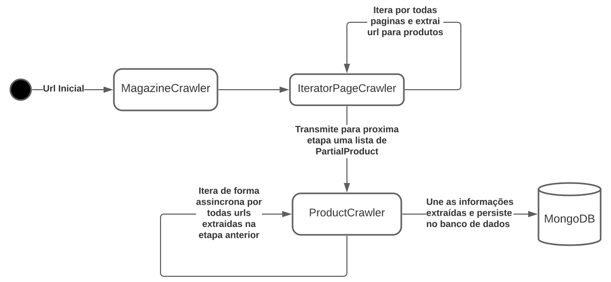

# magazine

## Setup

Para iniciar  o processo, é necessário que as dependências do projeto estejam corretamente instaladas. para isso
digite `make setup`

## Disponibilizando App e o banco de dados

O ambiente pode ser "erguido" utilizando o comando `make sbuild` (irá solicitar o root para montar a imagem do mongodb),
ou `make up`. 

Após o termino da operação, os `endpoints` estarão disponíveis.

## Populando banco de dados

Para efetuar o crawler da página deste [link](https://www.magazineluiza.com.br/aquecedor-eletrico/ar-e-ventilacao/s/ar/arae/brand---mondial), 
utilize `make crawl`.

### (Opicional) Criar indices necessários

Utilize o comando `make index`

## Endpoints
As rotas abaixo estão diponiveis para consulta em `localhost`, na porta `5000` -> `http://localhost:5000`

### Procurar Ean's 
endpoint: `/find-ean/<ean>`  
paramaters: `ean` -> string  
return: `JSON`  

Exemplo: `http://localhost:5000/find-ean/ean-123456`

### Procurar por um Sku 
endpoint: `/find-sku/<sku>` 
paramaters: `sku` -> string  
return: `JSON`  
Exemplo: `http://localhost:5000/find-sku/sku-123456`

### Countar numeros de items por marca
endpoint: `/count-items-by-brand/<brand>`  
paramaters: `brand` -> string  
return: `JSON`  
Exemplo: `http://0.0.0.0:5000/count-items-by-brand/MONDIAL`

### Countar numeros de items disponiveis e rupturas
endpoint: `/available-items`  
return: `JSON`  
Exemplo: `http://0.0.0.0:5000/available-items`  

## Overview da arquitetura

